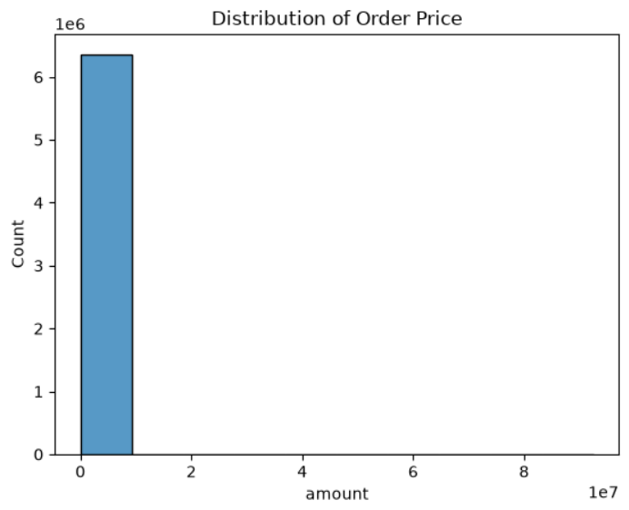
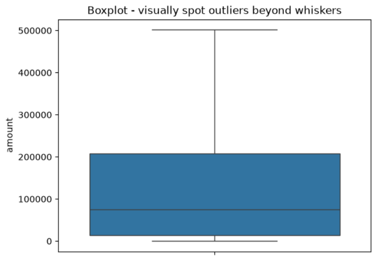
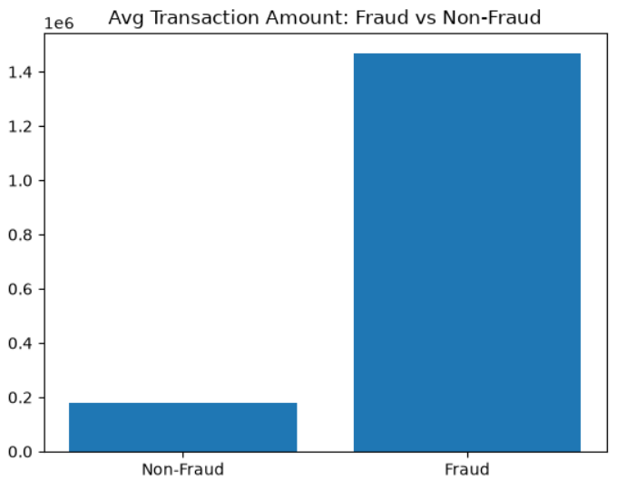
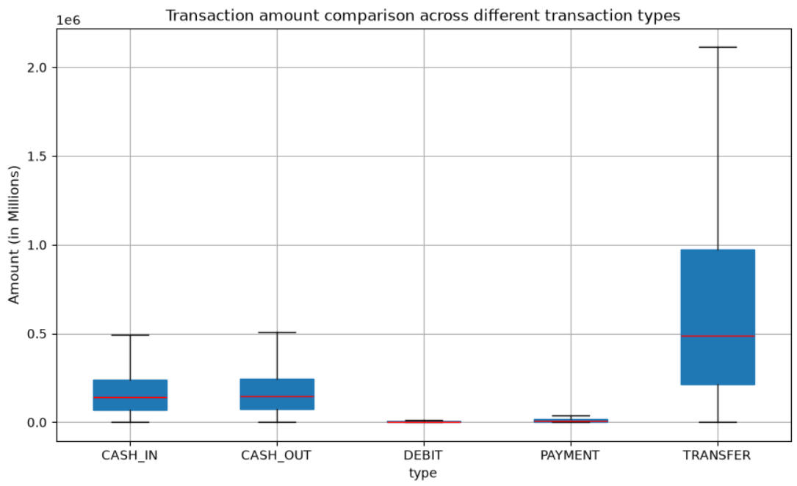
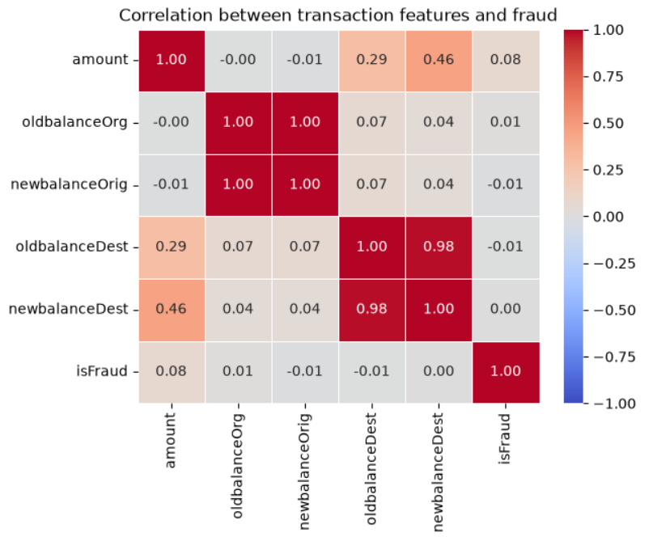

# Financial Fraud Detection Analytics

Statistical analysis of 10.48M real-world-structured mobile money transactions to identify patterns that distinguish fraudulent from legitimate activity, using descriptive statistics, outlier detection, hypothesis testing, and logistic regression.

<br>

## 📊 Dataset
- **Source:** [PaySim - Synthetic Financial Datasets For Fraud Detection](https://www.kaggle.com/datasets/ealaxi/paysim1) (Kaggle)
- **Size:** 10,48,576 transactions
- **Columns:** `type`, `amount`, `oldbalanceOrg`, `newbalanceOrig`, `oldbalanceDest`, `newbalanceDest`, `isFraud`

<br>

## 🎯 Business Questions & Methods

| Question | Method |
|---|---|
| What does typical transaction behavior look like? | Descriptive Statistics |
| Which transactions are abnormal? | IQR Outlier Detection |
| Do fraud transactions really differ in size? | T-test |
| Does amount vary by transaction type? | ANOVA |
| What predicts fraud? | Correlation + Logistic Regression |

<br>

## 📊 Key Visualizations

<table width="100%">
  <tr>
    <td width="50%" align="center">
      
    </td>
    <td width="50%" align="center">
      
    </td>
  </tr>
</table>

<table width="100%">
  <tr>
    <td width="50%" align="center">
      
    </td>
    <td width="50%" align="center">
      
    </td>
  </tr>
</table>

<table width="100%">
  <tr>
    <td width="100%" align="center">
      
    </td>
  </tr>
</table>


## 📈 Key Results

**Descriptive Statistics (amount):**
- Mean: 179,861.90 | Median: 74,871.94 | Std Dev: 603,858.23
- Skewness: 30.99 | Kurtosis: 1797.96 → extremely right-skewed with heavy-tailed outliers

**Outlier Detection:**
- IQR method flagged 338,078 transactions (5.31%) as outliers
- Fraud rate among Z-score outliers: **1.14%** vs overall fraud rate of **0.13%** → outliers are ~8.8x more likely to be fraud

**T-test — Fraud vs Non-Fraud Amount:**
- Fraud avg: 1,467,967.30 | Non-fraud avg: 178,197.04
- t = 48.615, **p < 0.001** → statistically significant; fraud transactions are ~8.2x larger on average
- 95% CI does not overlap between groups (Fraud: 1.42M–1.52M | Non-fraud: 177.7K–178.7K)

**ANOVA — Amount by Transaction Type:**
- F = 278,715.54, **p < 0.001**
- TRANSFER (910,647) and CASH_OUT (176,274) carry by far the highest average amounts — the two types most exploited for fraud

**Correlation with Fraud:**
- `amount`: 0.077 (strongest, though weak in raw correlation terms)
- Other balance fields show negligible correlation

**Logistic Regression (Pseudo R² = 0.518):**
- All three predictors (`amount`, `oldbalanceOrg`, `balance_diff_org`) statistically significant (p<0.001)
- Note: model shows signs of quasi-separation (~40% of cases perfectly predicted), suggesting a near-deterministic threshold pattern in how fraud transactions are structured — a useful lead for rule-based flagging in addition to the model itself

<br>

## 💡 Business Recommendation
Prioritize real-time monitoring on **TRANSFER** and **CASH_OUT** transaction types, using a combined rule of (a) statistical outlier flagging on `amount` and (b) balance-discrepancy checks — the two signals shown here to carry the strongest fraud relationship.

<br>

## 🛠️ Tools Used
Python · Pandas · SciPy · Statsmodels · Matplotlib · Seaborn

<br>


## 📂 Repository Structure

```text
├── data/
│   └── (Download Dataset: [https://www.kaggle.com/datasets/ealaxi/paysim1]
├── notebook/
│   └──data_analysis.ipynb
├── visuals/
├── LICENSE
└── README.md
```


<br>

## ⚠️ Limitations
- Regression shows quasi-separation, meaning some coefficients may be less stable — a regularized logistic regression (e.g., L2 penalty) or tree-based model (Random Forest) would be a natural next step for production use
- Analysis is exploratory/statistical, not a deployed fraud-detection system


<br>

## 👤 Author

**Bithi Nath**
🔗 [Bithi Nath](https://linkedin.com/in/bithinath)
🐙 [@bithiNath](https://github.com/bithiNath)


<br>


## 📄 License

This project is licensed under the **MIT License** — feel free to use, modify, and distribute.


<br>

## ⭐ Support

If you found this project helpful, please give it a **⭐ star** on GitHub!
Pull requests and feedback are always welcome. 🙌


